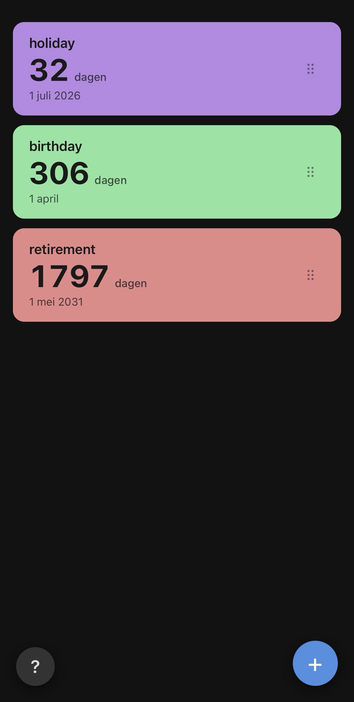

# Days Until...

Static web app that shows how many days until your events. All data lives in the URL query string (`?d=…`) — no backend, no login.

<p align="center">
  
</p>

> **Why query string and not `#`?** iOS Safari strips the hash fragment when using "Add to Home Screen" and in fullscreen PWA mode. Query strings are preserved. The trade-off: `?d=<base64>` ends up in your web server access logs (with the hash it does not).

## Run locally

```sh
cd days_until
python3 -m http.server 8000
```

Open <http://localhost:8000>. Click `+` to add an event. Drag the ≡ handle to reorder. Long-press a block to edit or delete it.

## Deploy on a Linux web server

1. **Upload** the whole folder (`index.html`, `app.js`, `style.css`, `manifest.json`, `sw.js`, `icons/`) to the web root of a virtual host served over **HTTPS**. Service workers only run on HTTPS (or localhost).

2. **MIME types** — make sure your web server serves these correctly:
   - `manifest.json` → `application/manifest+json`
   - `sw.js` → `application/javascript`

   ### nginx example

   ```nginx
   types {
       application/manifest+json    webmanifest manifest.json;
       application/javascript        js;
   }

   # Security headers (defense in depth — CSP is also set as meta tag in index.html)
   add_header Strict-Transport-Security "max-age=31536000; includeSubDomains" always;
   add_header X-Content-Type-Options "nosniff" always;
   add_header Referrer-Policy "same-origin" always;
   add_header X-Frame-Options "DENY" always;
   add_header Content-Security-Policy "default-src 'self'; script-src 'self'; style-src 'self' 'unsafe-inline'; img-src 'self' data:; connect-src 'self'; manifest-src 'self' blob:; base-uri 'none'; form-action 'self'; frame-ancestors 'none'" always;
   add_header Permissions-Policy "vibrate=(self), interest-cohort=()" always;

   location = /sw.js {
       add_header Cache-Control "no-cache";
   }
   location ~* \.(png|css)$ {
       add_header Cache-Control "public, max-age=2592000";
   }
   ```

   ### Apache example (`.htaccess`)

   ```apache
   AddType application/manifest+json .json

   # Security headers (defense in depth)
   Header always set Strict-Transport-Security "max-age=31536000; includeSubDomains"
   Header always set X-Content-Type-Options "nosniff"
   Header always set Referrer-Policy "same-origin"
   Header always set X-Frame-Options "DENY"
   Header always set Content-Security-Policy "default-src 'self'; script-src 'self'; style-src 'self' 'unsafe-inline'; img-src 'self' data:; connect-src 'self'; manifest-src 'self' blob:; base-uri 'none'; form-action 'self'; frame-ancestors 'none'"
   Header always set Permissions-Policy "vibrate=(self), interest-cohort=()"

   <Files "sw.js">
     Header set Cache-Control "no-cache"
   </Files>
   ```

3. **On your iPhone**:
   - Open the URL in Safari.
   - Tap the share button → **Add to Home Screen**.
   - Launch the app from the home screen — it starts fullscreen, without the Safari chrome.

4. **On Android / desktop Chrome / Edge**:
   - Open the URL in the browser. After it loads, Chrome shows an install icon
     in the address bar (or a "Install app" entry in the menu).
   - Install — the app captures the current URL (with your events) as its
     launch URL.

5. **When you make changes**: the URL changes, so you need to re-install /
   re-add the icon to the home screen. Remove the old icon, open the new URL,
   and add/install it again. This is by design: stateless, no server state.

## Updating / deploying a new version

The service worker caches all assets. Whenever you change `app.js`/`style.css`/`index.html`:

1. Bump `VERSION` in `sw.js` (e.g. `v1` → `v2`).
2. Upload all changed files.
3. The new SW activates on the next visit and clears the old cache.

## Files

| File | Purpose |
|---|---|
| `index.html` | Markup + iOS PWA meta tags |
| `app.js` | All logic (URL encoding, render, modal, drag) |
| `style.css` | Mobile-first responsive styling |
| `manifest.json` | PWA manifest |
| `sw.js` | Service worker (cache-first) |
| `icons/` | App icons (192/512/180) |
